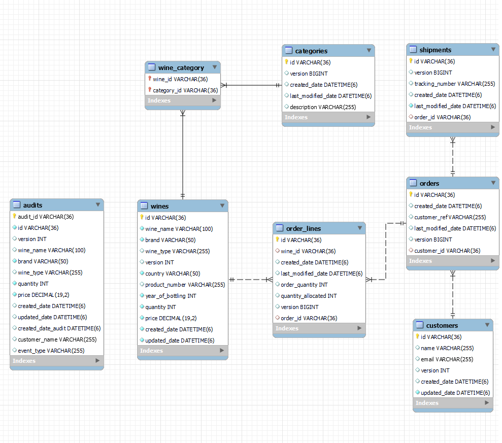

# Simple Spring and Kafka demo project

## Description

This repository contains a modular Java-based backend system built with Spring Boot, Apache Kafka, JPA, and MySQL. It demonstrates event-driven microservice communication using Kafka and clean architecture practices with a shared parent module and separate microservices.

## Technologies

Software: Spring, Java 21, JPA (Hibernate), Apache Kafka, MySQL, Mapstruct, Lombok, Flyway, Maven

## Structure

```tree
spring-kafka-simple-demo/
│
├── parent/ # Shared dependencies and configuration (Maven parent)
├── wine-backend/ # Main backend service (e.g., REST API, Kafka producer)
├── cold-service/ # Microservice 1 (Kafka consumer)
├── cool-service/ # Microservice 2 (Kafka consumer)
├── icecold-service/ # Microservice 3 (Kafka consumer)
└── README.md # Project documentation
```

## Modules Overview

parent:
- Maven parent with centralized dependency management.

- Shared config for all sub-modules.

wine-backend:

- Main API that handles CRUD operations for wine entities.

- Produces Kafka events for downstream services.

cold-service, cool-service, icecold-service:

- Microservices that consume Kafka messages and perform domain-specific tasks.

- Demonstrates Kafka topic subscription and message processing.

### Setup the environment

Enter to the "parent" project's folder and use the bash script. Required only once!

```bash
./mvnw install
```

### Images

